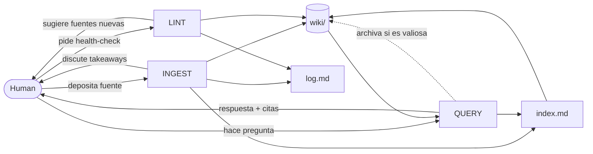

# LlmBrain-AK

[](https://claude.ai/code)
[](#)
[](https://gist.github.com/karpathy/442a6bf555914893e9891c11519de94f)

**Una base de conocimiento personal mantenida por un agente LLM — no un chatbot, un segundo cerebro persistente.**

> Implementacion del patron [LLM Wiki de Andrej Karpathy](https://gist.github.com/karpathy/442a6bf555914893e9891c11519de94f)

---

## El problema con RAG

La mayoria usa los LLMs como buscadores: pregunta, respuesta, olvido. Los sistemas RAG tradicionales (NotebookLM, ChatGPT file uploads) redescubren el conocimiento desde cero en cada consulta. No acumulan nada.

> *"The tedious part of maintaining a knowledge base is not the reading or the thinking — it's the bookkeeping."*
> — Andrej Karpathy

---

## La idea

En lugar de recuperar fragmentos al momento de la consulta, el LLM **construye y mantiene una wiki persistente** que se compone con el tiempo.

Cada vez que agregas una fuente, el agente no solo la indexa — la lee, discute los takeaways clave contigo, y actualiza 10-15 paginas relacionadas: resuelve contradicciones, completa gaps, refuerza cross-references. **El conocimiento se compila una vez y se mantiene actualizado**, no se re-deriva en cada query.

```
RAG tradicional:   fuente → chunks → vector store → recuperar en cada query
LlmBrain-AK:       fuente → dialogo → wiki persistente → consulta directa
```

---

## Arquitectura

```
LlmBrain-AK/
│
├── sources/               # Fuentes crudas — inmutables, verdad de origen
│   ├── articulo.md        # Papers, articulos, notas, transcripciones
│   └── assets/            # Imagenes descargadas localmente
│
├── wiki/                  # Paginas generadas por el LLM — el agente es dueno de esta capa
│   ├── _template.md       # Template con frontmatter para nuevas paginas
│   └── concepto-a.md      # Una pagina por entidad, concepto o tema
│
├── index.md               # Catalogo de contenido — se actualiza en cada ingest
├── log.md                 # Registro cronologico append-only de toda actividad
├── CLAUDE.md              # Schema operativo para Claude Code
├── AGENTS.md              # Schema operativo para otros agentes (Codex, OpenCode)
└── SETUP.md               # Guia de inicializacion para nuevos dominios
```

**Regla fundamental:** el humano escribe en `sources/`. El LLM escribe en `wiki/`. Nunca al reves.

---

## Flujo del sistema



---

## Las tres operaciones

### `INGEST` — agregar una fuente nueva

```
"ingest sources/articulo.md"
```

1. El agente lee la fuente completa
2. **Discute los takeaways clave contigo** — confirma que enfatizar antes de escribir
3. Crea la pagina de resumen en `wiki/`
4. Actualiza 10-15 paginas relacionadas (entidades, conceptos, comparaciones)
5. Actualiza `index.md` y registra en `log.md`

El ingest es un dialogo, no un proceso batch silencioso.

---

### `QUERY` — consultar la wiki

```
"que dice la wiki sobre X?"
"compara A con B"
"genera un resumen ejecutivo de todo lo que se sabe sobre Y"
```

1. Lee `index.md` para identificar paginas relevantes
2. Drill down sobre esas paginas
3. Sintetiza respuesta con citas
4. **Archiva la respuesta como nueva pagina wiki** si es valiosa — las exploraciones componen el conocimiento igual que las fuentes

Formatos de salida disponibles segun la consulta:

| Formato | Cuando usarlo |
|---------|--------------|
| Pagina markdown | respuesta narrativa, analisis |
| Tabla comparativa | contrastar conceptos o entidades |
| Slide deck (Marp) | presentar hallazgos |
| Chart (matplotlib) | datos cuantitativos |
| Canvas / overview | mapa del dominio completo |

---

### `LINT` — health check de la wiki

```
"lint the wiki"
```

**Deteccion:**
- Paginas huerfanas (sin links entrantes)
- Afirmaciones contradictorias entre paginas
- Claims desactualizados por fuentes mas recientes
- Conceptos referenciados pero sin pagina propia
- Data gaps resolubles con una busqueda web

**Proactivo:**
- Sugiere nuevas preguntas que la wiki aun no responde
- Sugiere nuevas fuentes a buscar para cubrir los gaps
- Genera reporte completo en `log.md`

---

## Quickstart

```bash
# 1. Clonar
git clone https://github.com/devsart95/LlmBrain-AK
cd LlmBrain-AK

# 2. Leer SETUP.md y configurar el dominio
# Editar CLAUDE.md con tus categorias

# 3. Abrir con Claude Code
claude .

# 4. Cambiar a Opus para operaciones profundas
/model opus

# 5. Primer ingest
# Depositar un archivo en sources/, luego:
# "ingest sources/mi-articulo.md"

# 6. Consultar
# "que dice la wiki sobre X?"

# 7. Mantenimiento periodico
# "lint the wiki"
```

Ver `SETUP.md` para la guia completa de inicializacion.

---

## Asignacion de modelos

| Operacion | Modelo | Razon |
|-----------|--------|-------|
| Ingest | **Opus** | Razonamiento profundo, conexiones entre conceptos |
| Lint | **Opus** | Deteccion de contradicciones, sugerencias proactivas |
| Query | **Opus** | Sintesis multi-fuente |
| Busqueda / lectura | **Sonnet** | Rapido y eficiente para recuperar contexto |

---

## Herramientas opcionales

Sin codigo requerido hasta que la escala lo demande (~100 paginas).

| Herramienta | Funcion |
|-------------|---------|
| [qmd](https://github.com/tobi/qmd) | Busqueda semantica local BM25/vector con MCP server |
| [Obsidian](https://obsidian.md) | Graph view para visualizar conexiones, renderiza `[[wiki-links]]` |
| [Obsidian Web Clipper](https://obsidian.md/clipper) | Convierte articulos web a markdown antes del ingest |
| [Marp](https://marp.app) | Presentaciones desde paginas wiki en markdown |
| [Dataview](https://blacksmithgu.github.io/obsidian-dataview/) | Queries sobre frontmatter YAML — requiere campos en `wiki/_template.md` |

---

## Privacidad

`sources/` y `wiki/` contienen tu conocimiento personal. Si el contenido es sensible, agregar al `.gitignore`:

```gitignore
sources/**/*.pdf
sources/**/*.md
wiki/*.md
!wiki/_template.md
!wiki/.gitkeep
```

Los archivos de framework (`CLAUDE.md`, `AGENTS.md`, `index.md`, `log.md`, `SETUP.md`) no contienen datos personales.

---

## Nota

Este repositorio es intencionalmente un punto de partida, no un framework rigido. La estructura de directorios, las convenciones de las paginas, el schema del agente — todo depende de tu dominio y tus preferencias. Tomar lo que sirve, ignorar lo que no. El agente puede ayudarte a adaptar el sistema desde el primer dia.

---

## Creditos

Patron original por [Andrej Karpathy](https://gist.github.com/karpathy/442a6bf555914893e9891c11519de94f).
Implementacion por [devsart95](https://github.com/devsart95) — Paraguay
