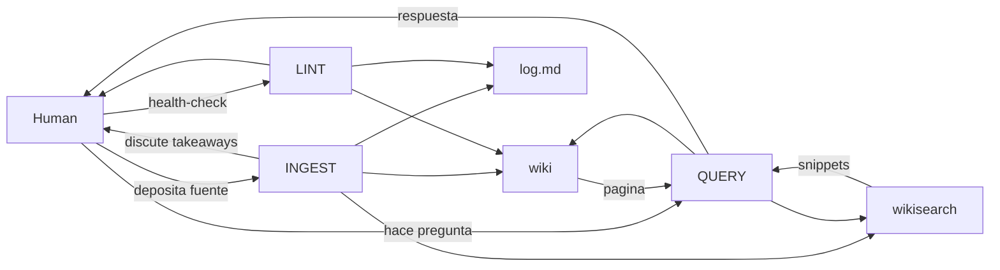

# LlmBrain-AK

[](https://claude.ai/code)
[](#)
[](https://gist.github.com/karpathy/442a6bf555914893e9891c11519de94f)

**Una base de conocimiento personal mantenida por un agente LLM — no un chatbot, un segundo cerebro persistente.**

---

## El problema

RAG redescubre el conocimiento desde cero en cada query. Pregunta, respuesta, olvido. No acumula nada.

> *"The tedious part of maintaining a knowledge base is not the reading or the thinking — it's the bookkeeping."*
> — Andrej Karpathy

LlmBrain-AK hace lo opuesto: el agente **construye y mantiene una wiki persistente** que se compone con el tiempo. Cada fuente que agregas se integra con todo lo anterior — resuelve contradicciones, completa gaps, actualiza 10-15 paginas relacionadas. **El conocimiento se compila una vez**, no se re-deriva en cada consulta.

```
RAG:          fuente → chunks → vector store → recuperar en cada query
LlmBrain-AK:  fuente → dialogo → wiki persistente → consulta directa
```

---

## Arquitectura

```
LlmBrain-AK/
│
├── sources/               # Fuentes crudas — inmutables, verdad de origen
│   ├── articulo.md        # Papers, articulos, notas, transcripciones
│   └── assets/            # Imagenes descargadas localmente
│
├── wiki/                  # Paginas generadas por el LLM — el agente es dueno de esta capa
│   ├── _template.md       # Template con frontmatter para nuevas paginas
│   └── concepto-a.md      # Una pagina por entidad, concepto o tema
│
├── index.md               # Catalogo de contenido — se actualiza en cada ingest
├── log.md                 # Registro cronologico append-only de toda actividad
├── CLAUDE.md              # Schema operativo para Claude Code
├── AGENTS.md              # Schema operativo para otros agentes (Codex, OpenCode)
└── SETUP.md               # Guia de inicializacion para nuevos dominios
```

**Regla fundamental:** el humano escribe en `sources/`. El LLM escribe en `wiki/`. Nunca al reves.

---

## Flujo del sistema



---

## Las tres operaciones

### `INGEST` — agregar una fuente nueva

```
"ingest sources/articulo.md"
```

1. El agente lee la fuente completa
2. **Discute los takeaways clave contigo** — confirma que enfatizar antes de escribir
3. Crea la pagina de resumen en `wiki/`
4. Actualiza 10-15 paginas relacionadas (entidades, conceptos, comparaciones)
5. Actualiza `index.md`, registra en `log.md`, sincroniza `wiki_index()`

El ingest es un dialogo, no un proceso batch silencioso.

---

### `QUERY` — consultar la wiki

```
"que dice la wiki sobre X?"
"compara A con B"
"genera un resumen ejecutivo de todo lo que se sabe sobre Y"
```

1. `wiki_search(query)` — recupera snippets comprimidos sin leer archivos completos
2. `wiki_get(filename)` — lee solo las paginas que realmente necesitas
3. Sintetiza respuesta con citas
4. **Archiva si es valiosa** — las exploraciones componen el conocimiento igual que las fuentes

Formatos de salida segun la consulta:

| Formato | Cuando usarlo |
|---------|--------------|
| Pagina markdown | respuesta narrativa, analisis |
| Tabla comparativa | contrastar conceptos o entidades |
| Slide deck (Marp) | presentar hallazgos |
| Chart (matplotlib) | datos cuantitativos |
| Canvas / overview | mapa del dominio completo |

---

### `LINT` — health check de la wiki

```
"lint the wiki"
```

**Deteccion:**
- Paginas huerfanas (sin links entrantes)
- Afirmaciones contradictorias entre paginas
- Claims desactualizados por fuentes mas recientes
- Conceptos referenciados pero sin pagina propia

**Proactivo:**
- Sugiere nuevas preguntas que la wiki aun no responde
- Sugiere nuevas fuentes a buscar para cubrir los gaps
- Genera reporte completo en `log.md`

---

## Quickstart

```bash
# 1. Clonar
git clone https://github.com/devsart95/LlmBrain-AK
cd LlmBrain-AK

# 2. Instalar el modulo de busqueda
pip install -e .

# 3. Construir el indice (primera vez — ~55s por descarga del modelo embedding)
wiki index

# 4. Leer SETUP.md y configurar el dominio
# Editar CLAUDE.md con tus categorias y tipos de pagina

# 5. Abrir con Claude Code (carga el MCP automaticamente via .mcp.json)
claude .

# 6. Primer ingest
# Depositar un archivo en sources/, luego:
# "ingest sources/mi-articulo.md"

# 7. Consultar
# "que dice la wiki sobre X?"

# 8. Mantenimiento periodico
# "lint the wiki"
```

Ver `SETUP.md` para la guia completa de inicializacion.

---

## Asignacion de modelos

| Operacion | Modelo | Razon |
|-----------|--------|-------|
| Ingest | **Opus** | Razonamiento profundo, conexiones entre conceptos |
| Lint | **Opus** | Deteccion de contradicciones, sugerencias proactivas |
| Query | **Opus** | Sintesis multi-fuente |
| Busqueda / lectura | **Sonnet** | Rapido y eficiente para recuperar contexto |

---

## Motor de busqueda — `wikisearch`

A medida que la wiki crece, leer todo se vuelve imposible. 500 paginas = ~15,000 tokens solo en `index.md`. Leer 10 paginas para responder algo simple: otros ~15,000.

`wikisearch` resuelve esto con un pipeline de 3 etapas con early exit:

```
Etapa 1 — MetaFilter    filtra por frontmatter YAML (type, tags, title)
                         costo: 0ms, 0 tokens
                         500 paginas → 10-30 candidatos

Etapa 2 — BM25          ranking lexical sobre titulos + tags + snippets
                         costo: <5ms, sin API, sin embeddings
                         30 candidatos → top-10

Etapa 3 — SemanticRerank similitud coseno sobre embeddings precalculados
                         costo: ~50ms en CPU, sin API externa
                         top-10 → top-5 reordenados por relevancia semantica
```

Sale en la etapa mas barata que sea suficiente. La mayoria de queries con filtros explicitos terminan en etapa 1.

**Sin modulo:** el agente lee `index.md` + paginas relevantes — entre 10,000 y 18,000 tokens por query.

**Con modulo:** snippets comprimidos (~150 tokens c/u) + solo las paginas necesarias. **~2,700 tokens. 85% menos.**

### Demo — query real

Pregunta: *"Estoy armando un formulario de login, que tengo que tener en cuenta?"*

```
# El agente ejecuta:
wiki_search("formulario login")
wiki_search("accesibilidad formularios inputs validacion")
→ 5 snippets, ~750 tokens

wiki_get("ux-guidelines-formularios-accesibilidad.md")
wiki_get("react-shadcn-patterns.md")
wiki_get("patron-estados-ui.md")
→ 3 paginas completas, ~1,800 tokens

Total: ~2,550 tokens
Sin wikisearch: ~10,000-18,000 tokens
```

Respuesta con citas precisas:

```
Estructura: react-hook-form + zod + shadcn FormField
  - Label visible siempre, no solo placeholder [High]
  - type="email" + autoComplete="email" [Medium]
  - Toggle show/hide en password [Medium]
  - Nunca bloquear paste en password [High]
  - Errores inline bajo cada campo [Medium]

Accesibilidad:
  - aria-label en boton show/hide [Critical]
  - focus-visible:ring-2 en interactivos [Critical]
  - role="alert" en mensajes de error [High]

Submit:
  - Spinner durante loading, no deshabilitar el boton
  - Error de credenciales: mensaje inline, no toast

Citas: ux-guidelines-formularios-accesibilidad.md,
       react-shadcn-patterns.md, patron-estados-ui.md
```

### Tecnologia

| Componente | Libreria | Detalle |
|------------|----------|---------|
| BM25 | `rank-bm25` | BM25Okapi sobre corpus tokenizado en disco |
| Embeddings | `sentence-transformers` | `gte-small` — 33M params, 384 dims, ~67MB, 100% local |
| Similitud | `numpy` | Cosine similarity sobre matriz `.npz` — sin vector DB |
| Frontmatter | `python-frontmatter` | Parseo de YAML en cada pagina wiki |
| CLI | `click` | `wiki search`, `wiki get`, `wiki tags`, `wiki lint`, `wiki index` |
| MCP Server | `fastmcp` | 4 tools disponibles directamente en Claude Code |

Sin servidor. Sin API externa. Todo corre en CPU local.

### CLI

```bash
wiki index                                    # sincronizar indice
wiki search "query"                           # buscar (devuelve snippets)
wiki search "query" --type concept --top 3   # con filtros
wiki get pagina.md                            # leer pagina completa
wiki tags                                     # explorar el dominio
wiki lint                                     # health check
```

### MCP en Claude Code

`.mcp.json` en la raiz configura el servidor automaticamente. Al abrir con `claude .`, el agente tiene estas tools nativas:

| Tool | Que hace |
|------|----------|
| `wiki_search(query, types, tags)` | Devuelve snippets, no paginas completas |
| `wiki_get(filename)` | Lee una pagina — usar solo cuando el snippet no alcanza |
| `wiki_tags()` | Lista tags con conteo — explorar antes de buscar |
| `wiki_index(rebuild)` | Sincroniza el indice despues de un ingest |

El indice es incremental: compara `mtime` + `size` y solo re-indexa lo que cambio. Un ingest tipico (15 paginas) tarda ~800ms.

---

## Herramientas opcionales

| Herramienta | Funcion |
|-------------|---------|
| [Obsidian](https://obsidian.md) | Graph view para visualizar conexiones, renderiza `[[wiki-links]]` |
| [Obsidian Web Clipper](https://obsidian.md/clipper) | Convierte articulos web a markdown antes del ingest |
| [Marp](https://marp.app) | Exportar paginas wiki a presentaciones markdown |
| [Dataview](https://blacksmithgu.github.io/obsidian-dataview/) | Queries dinamicas sobre frontmatter YAML |

---

## Privacidad

`sources/` y `wiki/` contienen tu conocimiento personal. Si el contenido es sensible, agregar al `.gitignore`:

```gitignore
sources/**/*.pdf
sources/**/*.md
wiki/*.md
!wiki/_template.md
!wiki/.gitkeep
```

Los archivos de framework (`CLAUDE.md`, `AGENTS.md`, `index.md`, `log.md`, `SETUP.md`) no contienen datos personales.

---

## Nota

Este repositorio es intencionalmente un punto de partida, no un framework rigido. La estructura, las convenciones, el schema — todo depende de tu dominio. Tomar lo que sirve, ignorar lo que no. El agente puede ayudarte a adaptar el sistema desde el primer dia.

---

## Creditos

Patron original por [Andrej Karpathy](https://gist.github.com/karpathy/442a6bf555914893e9891c11519de94f).
Implementacion por [devsart95](https://github.com/devsart95) — Paraguay
